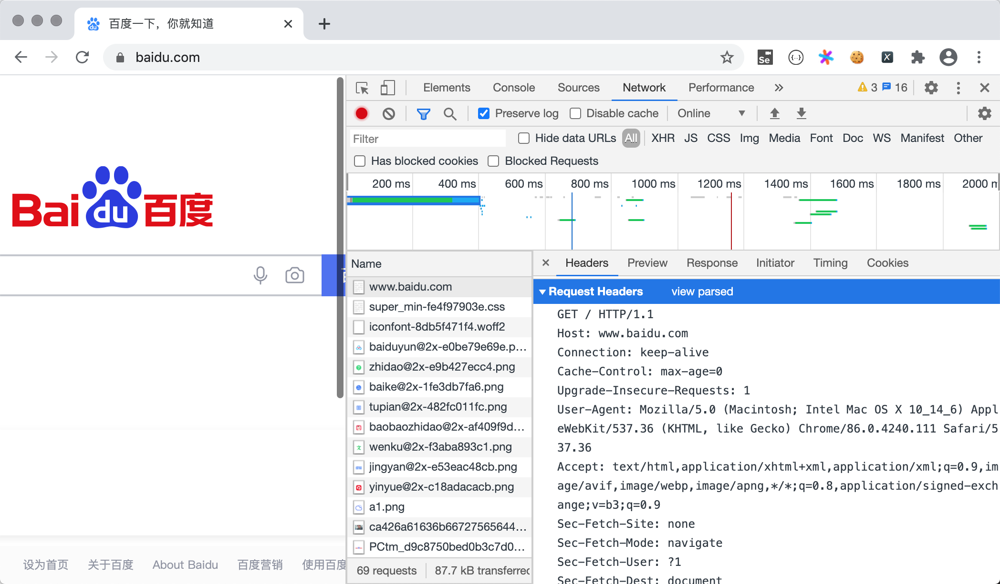
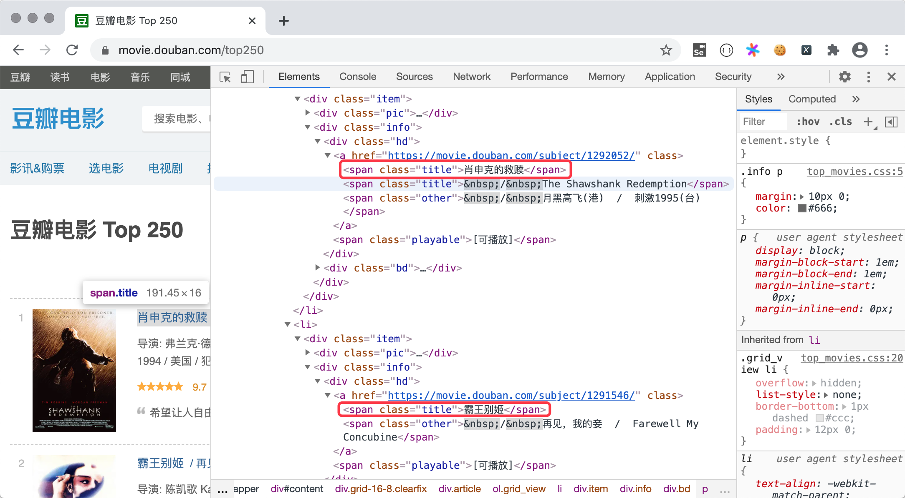
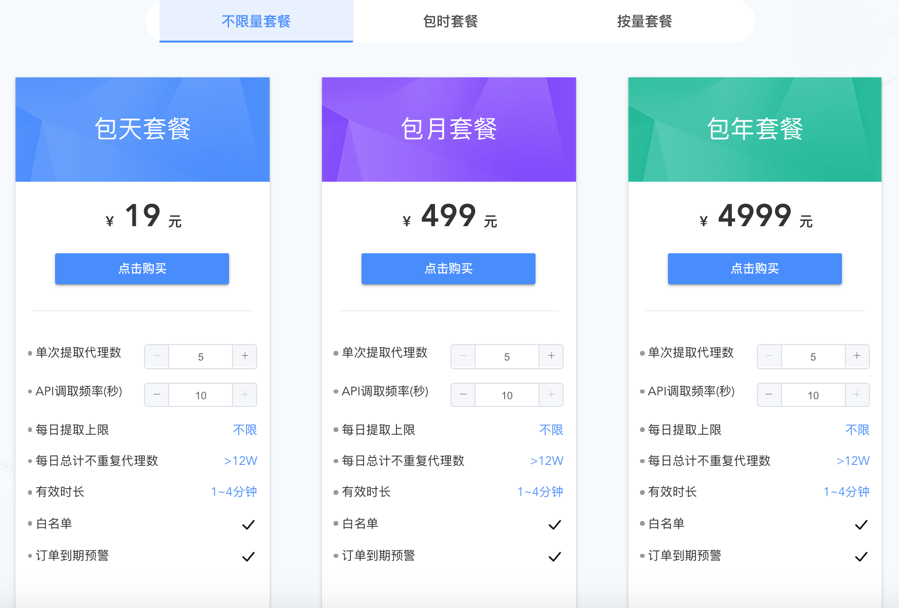

## 用Python获取网络数据

网络数据采集是 Python 语言非常擅长的领域，上节课我们讲到，实现网络数据采集的程序通常称之为网络爬虫或蜘蛛程序。即便是在大数据时代，数据对于中小企业来说仍然是硬伤和短板，有些数据需要通过开放或付费的数据接口来获得，其他的行业数据和竞对数据则必须要通过网络数据采集的方式来获得。不管使用哪种方式获取网络数据资源，Python 语言都是非常好的选择，因为 Python 的标准库和三方库都对网络数据采集提供了良好的支持。

### requests库

要使用 Python 获取网络数据，我们推荐大家使用名为`requests` 的三方库，这个库我们在之前的课程中其实已经使用过了。按照官方网站的解释，`requests`是基于 Python 标准库进行了封装，简化了通过 HTTP 或 HTTPS 访问网络资源的操作。上课我们提到过，HTTP 是一个请求响应式的协议，当我们在浏览器中输入正确的 [URL](https://developer.mozilla.org/zh-CN/docs/Learn/Common_questions/What_is_a_URL)（通常也称为网址）并按下 Enter 键时，我们就向网络上的 [Web 服务器](https://developer.mozilla.org/zh-CN/docs/Learn/Common_questions/What_is_a_web_server)发送了一个 HTTP 请求，服务器在收到请求后会给我们一个 HTTP 响应。在 Chrome 浏览器中的菜单中打开“开发者工具”切换到“Network”选项卡就能够查看 HTTP 请求和响应到底是什么样子的，如下图所示。



通过`requests`库，我们可以让 Python 程序向浏览器一样向 Web 服务器发起请求，并接收服务器返回的响应，从响应中我们就可以提取出想要的数据。浏览器呈现给我们的网页是用 [HTML](https://developer.mozilla.org/zh-CN/docs/Web/HTML) 编写的，浏览器相当于是 HTML 的解释器环境，我们看到的网页中的内容都包含在 HTML 的标签中。在获取到 HTML 代码后，就可以从标签的属性或标签体中提取内容。下面例子演示了如何获取网页 HTML 代码，我们通过`requests`库的`get`函数，获取了搜狐首页的代码。

```Python
# 导入requests库
# requests：Python的HTTP客户端库，用于发送HTTP请求
# 安装：pip install requests
import requests

# 发送GET请求获取搜狐首页
# requests.get(url)：发送GET请求到指定URL
# 返回值：Response对象，包含服务器响应
resp = requests.get('https://www.sohu.com/')

# 检查响应状态码
# resp.status_code：HTTP响应状态码
# 200：表示请求成功
if resp.status_code == 200:
    # 获取响应内容（HTML代码）
    # resp.text：以字符串形式获取响应内容
    # 自动处理编码，通常用于获取HTML、JSON等文本内容
    print(resp.text)
```

> **说明**：上面代码中的变量`resp`是一个`Response`对象（`requests`库封装的类型），通过该对象的`status_code`属性可以获取响应状态码，而该对象的`text`属性可以帮我们获取到页面的 HTML 代码。

由于`Response`对象的`text`是一个字符串，所以我们可以利用之前讲过的正则表达式的知识，从页面的 HTML 代码中提取新闻的标题和链接，代码如下所示。

```Python
# 导入re模块（正则表达式模块）
# re：Python内置的正则表达式模块，用于模式匹配和文本处理
import re

# 导入requests库
import requests

# 编译正则表达式模式
# re.compile(pattern)：将正则表达式字符串编译为Pattern对象
# 提高匹配效率，可重复使用
# 模式说明：<a.*?href="(.*?)".*?title="(.*?)".*?>
# <a：匹配<a标签开始
# .*?：非贪婪匹配任意字符
# href="(.*?)"：捕获href属性值
# title="(.*?)"：捕获title属性值
pattern = re.compile(r'<a.*?href="(.*?)".*?title="(.*?)".*?>')

# 发送GET请求获取搜狐首页
resp = requests.get('https://www.sohu.com/')

# 检查响应状态码
if resp.status_code == 200:
    # 使用正则表达式查找所有匹配项
    # pattern.findall(text)：查找所有匹配的子串
    # 返回值：列表，每个元素是一个元组，包含捕获组的内容
    all_matches = pattern.findall(resp.text)
    
    # 遍历所有匹配项
    for href, title in all_matches:
        # 打印链接地址
        print(href)
        # 打印链接标题
        print(title)
```

除了文本内容，我们也可以使用`requests`库通过 URL 获取二进制资源。下面的例子演示了如何获取百度 Logo 并保存到名为`baidu.png`的本地文件中。可以在百度的首页上右键点击百度Logo，并通过“复制图片地址”菜单项获取图片的 URL。

```Python
# 导入requests库
import requests

# 发送GET请求获取百度Logo图片
# 图片URL：从百度首页右键复制图片地址获得
resp = requests.get('https://www.baidu.com/img/PCtm_d9c8750bed0b3c7d089fa7d55720d6cf.png')

# 使用with语句打开文件
# with语句：上下文管理器，自动处理文件的打开和关闭
# open(filename, mode)：打开文件
# 'baidu.png'：文件名
# 'wb'：写入模式（write binary），用于写入二进制文件
with open('baidu.png', 'wb') as file:
    # 写入二进制内容
    # resp.content：以字节形式获取响应内容
    # 用于获取图片、音频、视频等二进制文件
    file.write(resp.content)
```

> **说明**：`Response`对象的`content`属性可以获得服务器响应的二进制数据。

`requests`库非常好用而且功能上也比较强大和完整，具体的内容我们在使用的过程中为大家一点点剖析。想解锁关于`requests`库更多的知识，可以阅读它的[官方文档](https://docs.python-requests.org/zh_CN/latest/)。

### 编写爬虫代码

接下来，我们以“豆瓣电影”为例，为大家讲解如何编写爬虫代码。按照上面提供的方法，我们先使用`requests`获取到网页的HTML代码，然后将整个代码看成一个长字符串，这样我们就可以使用正则表达式的捕获组从字符串提取我们需要的内容。下面的代码演示了如何从[豆瓣电影](https://movie.douban.com/)获取排前250名的电影的名称。[豆瓣电影Top250](https://movie.douban.com/top250)的页面结构和对应代码如下图所示，可以看出，每页共展示了25部电影，如果要获取到 Top250 数据，我们共需要访问10个页面，对应的地址是<https://movie.douban.com/top250?start=xxx>，这里的`xxx`如果为`0`就是第一页，如果`xxx`的值是`100`，那么我们可以访问到第五页。为了代码简单易读，我们只获取电影的标题和评分。



```Python
# 导入random模块
# random：Python内置的随机数模块
import random
# 导入re模块（正则表达式模块）
import re
# 导入time模块
# time：Python内置的时间模块，用于时间相关操作
import time

# 导入requests库
import requests

# 循环爬取10个页面
# range(1, 11)：生成1到10的整数序列（包含1，不包含11）
for page in range(1, 11):
    # 发送GET请求获取豆瓣电影Top250页面
    # url参数：使用f-string格式化URL
    # (page - 1) * 25：计算每个页面的起始位置
    # 每页显示25部电影，第1页start=0，第2页start=25，以此类推
    resp = requests.get(
        url=f'https://movie.douban.com/top250?start={(page - 1) * 25}',
        # 如果不设置HTTP请求头中的User-Agent，豆瓣会检测出不是浏览器而阻止我们的请求。
        # 通过get函数的headers参数设置User-Agent的值，具体的值可以在浏览器的开发者工具查看到。
        # 用爬虫访问大部分网站时，将爬虫伪装成来自浏览器的请求都是非常重要的一步。
        headers={
            'User-Agent': 'Mozilla/5.0 (Macintosh; Intel Mac OS X 10_14_6) AppleWebKit/537.36 (KHTML, like Gecko) Chrome/92.0.4515.159 Safari/537.36'
        }
    )
    
    # 通过正则表达式获取class属性为title且标签体不以&开头的span标签并用捕获组提取标签内容
    # 模式说明：<span class="title">([^&]*?)</span>
    # <span class="title">：匹配标签开始
    # ([^&]*?)：捕获组，匹配不包含&的任意字符
    # </span>：匹配标签结束
    pattern1 = re.compile(r'<span class="title">([^&]*?)</span>')
    # 查找所有匹配的电影标题
    titles = pattern1.findall(resp.text)
    
    # 通过正则表达式获取class属性为rating_num的span标签并用捕获组提取标签内容
    # 模式说明：<span class="rating_num".*?>(.*?)</span>
    # <span class="rating_num".*?>：匹配标签开始，.*?表示任意属性
    # (.*?)：捕获组，匹配标签内容
    # </span>：匹配标签结束
    pattern2 = re.compile(r'<span class="rating_num".*?>(.*?)</span>')
    # 查找所有匹配的电影评分
    ranks = pattern2.findall(resp.text)
    
    # 使用zip压缩两个列表，循环遍历所有的电影标题和评分
    # zip(titles, ranks)：将两个列表打包成元组列表
    # 例如：[(title1, rank1), (title2, rank2), ...]
    for title, rank in zip(titles, ranks):
        # 打印电影标题和评分
        print(title, rank)
    
    # 随机休眠1-5秒，避免爬取页面过于频繁
    # time.sleep(seconds)：让程序休眠指定秒数
    # random.random()：生成0-1之间的随机浮点数
    # random.random() * 4 + 1：生成1-5之间的随机浮点数
    time.sleep(random.random() * 4 + 1)
```

> **说明**：通过分析豆瓣网的robots协议，我们发现豆瓣网并不拒绝百度爬虫获取它的数据，因此我们也可以将爬虫伪装成百度的爬虫，将`get`函数的`headers`参数修改为：`headers={'User-Agent': 'BaiduSpider'}`。

### 使用 IP 代理

让爬虫程序隐匿自己的身份对编写爬虫程序来说是比较重要的，很多网站对爬虫都比较反感的，因为爬虫会耗费掉它们很多的网络带宽并制造很多无效的流量。要隐匿身份通常需要使用**商业 IP 代理**（如蘑菇代理、芝麻代理、快代理等），让被爬取的网站无法获取爬虫程序来源的真实 IP 地址，也就无法简单的通过 IP 地址对爬虫程序进行封禁。

下面以[蘑菇代理](http://www.moguproxy.com/)为例，为大家讲解商业 IP 代理的使用方法。首先需要在该网站注册一个账号，注册账号后就可以[购买](http://www.moguproxy.com/buy)相应的套餐来获得商业 IP 代理。作为商业用途，建议大家购买不限量套餐，这样可以根据实际需要获取足够多的代理 IP 地址；作为学习用途，可以购买包时套餐或根据自己的需求来决定。蘑菇代理提供了两种接入代理的方式，分别是 API 私密代理和 HTTP 隧道代理，前者是通过请求蘑菇代理的 API 接口获取代理服务器地址，后者是直接使用统一的入口（蘑菇代理提供的域名）进行接入。



下面，我们以HTTP隧道代理为例，为大家讲解接入 IP 代理的方式，大家也可以直接参考蘑菇代理官网提供的代码来为爬虫设置代理。

```Python
# 导入requests库
import requests

# 代理配置
# APP_KEY：代理服务的认证密钥
# 从代理服务商（蘑菇代理）的用户中心获取
APP_KEY = 'Wnp******************************XFx'

# PROXY_HOST：代理服务器地址
# 格式：域名:端口号
PROXY_HOST = 'secondtransfer.moguproxy.com:9001'

# 循环爬取10个页面
for page in range(1, 11):
    # 发送GET请求，使用代理服务器
    resp = requests.get(
        # 目标URL
        url=f'https://movie.douban.com/top250?start={(page - 1) * 25}',
        # 需要在HTTP请求头设置代理的身份认证方式
        headers={
            # Proxy-Authorization：代理认证头
            # Basic认证：将APP_KEY进行Base64编码
            'Proxy-Authorization': f'Basic {APP_KEY}',
            # User-Agent：伪装成浏览器
            'User-Agent': 'Mozilla/5.0 (Macintosh; Intel Mac OS X 10_14_6) AppleWebKit/537.36 (KHTML, like Gecko) Chrome/92.0.4515.159 Safari/537.36',
            # Accept-Language：接受的语言
            'Accept-Language': 'zh-CN,zh;q=0.8,en-US;q=0.6,en;q=0.4'
        },
        # 设置代理服务器
        # proxies参数：指定HTTP和HTTPS请求使用的代理
        proxies={
            'http': f'http://{PROXY_HOST}',
            'https': f'https://{PROXY_HOST}'
        },
        # verify参数：是否验证SSL证书
        # False：不验证证书（某些代理需要）
        verify=False
    )
    
    # 使用正则表达式提取电影标题
    pattern1 = re.compile(r'<span class="title">([^&]*?)</span>')
    titles = pattern1.findall(resp.text)
    
    # 使用正则表达式提取电影评分
    pattern2 = re.compile(r'<span class="rating_num".*?>(.*?)</span>')
    ranks = pattern2.findall(resp.text)
    
    # 遍历并打印电影标题和评分
    for title, rank in zip(titles, ranks):
        print(title, rank)
```

> **说明**：上面的代码需要修改`APP_KEY`为自己创建的订单对应的`Appkey`值，这个值可以在用户中心用户订单中查看到。蘑菇代理提供了免费的 API 代理和 HTTP 隧道代理试用，但是试用的代理接通率不能保证，建议大家还是直接购买一个在自己支付能力范围内的代理服务来体验。

###  总结

Python 语言能做的事情真的很多，就网络数据采集这一项而言，Python 几乎是一枝独秀的，大量的企业和个人都在使用 Python 从网络上获取自己需要的数据，这可能也是你将来日常工作的一部分。另外，用编写正则表达式的方式从网页中提取内容虽然可行，但是写出一个能够满足需求的正则表达式本身也不是件容易的事情，这一点对于新手来说尤为明显。在下一节课中，我们将会为大家介绍另外两种从页面中提取数据的方法，虽然从性能上来讲，它们可能不如正则表达式，但是却降低了编码的复杂性，相信大家会喜欢上它们的。
